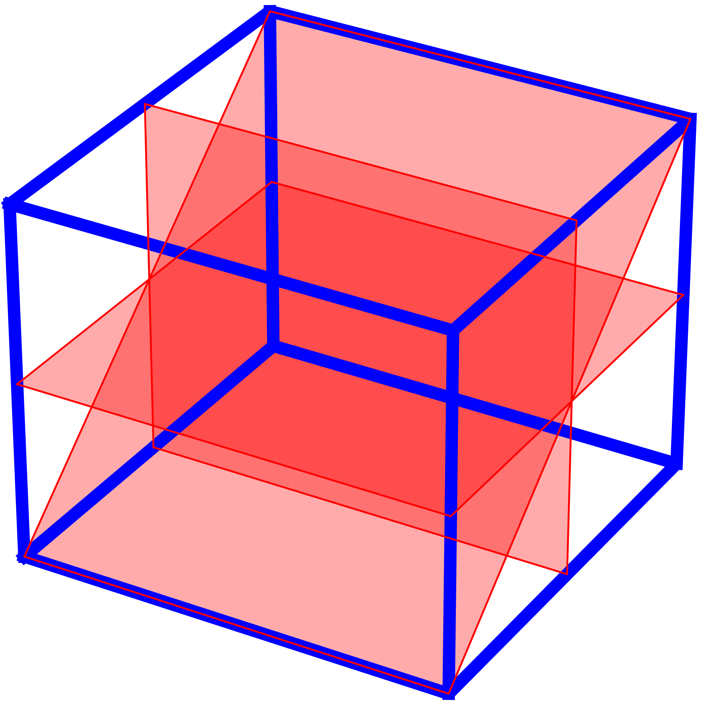

# Reslice3Dto2D

Version 3.1

This sourcecode is part of the publication: _Viezzer, D. et al. Reslice3Dto2D: Introduction of a software tool to reformat quantitative 3D volumes measurements into 
reference 2D slices in cardiovascular magnetic resonance imaging._ (DOI: tba) 

## Installation
The Reslice3Dto2D_Windows.exe contains the whole software as an executable for Windows, such that an installation is not necessary.
The Reslice3Dto2D_macOS executable file contains the whole software as an executable for macOS, such that an installation is not necessary.
Alternatively the below instructions installs the software for either Windows or macOS:

The Reslice3Dto2D is implemented in Python (Version 3.8, Python Software Foundation). Accordingly, 
Python needs to be installed in the specified version from https://www.python.org if it is not yet installed on the machine. 
For Microsoft Windows ensure that during installation Python is added to the system environment variable PATH. 
After download of the source-code, unpack the compressed file and move into the scripts sub-directory. 
For Microsoft Windows please run via double click the INSTALL_windows.bat to install all necessary Python site packages. 
After successful installation, the tool can be started via RUN_windows.bat. For macOS users, please open a Terminal and 
go to this directory. Run the following two commands, to make the command files executable:

chmod 700 INSTALL_macOS.command

chmod 700 RUN_macOS.command

You can now close the Terminal and install the necessary site packages via double click on INSTALL_macOS.command. 
After successful installation, the RUN_macOS.command starts the application. In the current version, the following 
site-packages of Python are necessary: numpy, pydicom, PyQt5, qimage2ndarray and scipy.

## Usage
Instructions on usage are provided in the User Manual.

## Prerequisites
The file ending is irrelevant as loaded data is checked for containing DICOM. However, the following DICOM tags must 
exist:

0x0020, 0x000d  study UID

0x0010, 0x0010  patient name

0x0020, 0x0011  series number

0x0008, 0x103e  series description

0x0020, 0x0013  instance number

0x0018, 0x0023  acquisition type

0x0020, 0x0032  image position

0x0020, 0x0037  image orientation

0x0018, 0x0050  slice thickness

## Pyinstaller
To create an executable file on your own with pyinstaller the following command can be used with [PATH] representing the directory path
to this project:

python -m PyInstaller -F --clean --collect-submodules=pydicom --add-data "[PATH]\sourcecode\gui_main.ui;." --add-data 
"[PATH]\sourcecode\gui_dialog_stack.ui;." --add-data "[PATH]\sourcecode\logo.png;." -i "[PATH]\sourcecode\logo.png" 
--specpath ./pyinstaller --workpath ./pyinstaller --distpath . Reslice3Dto2D.py