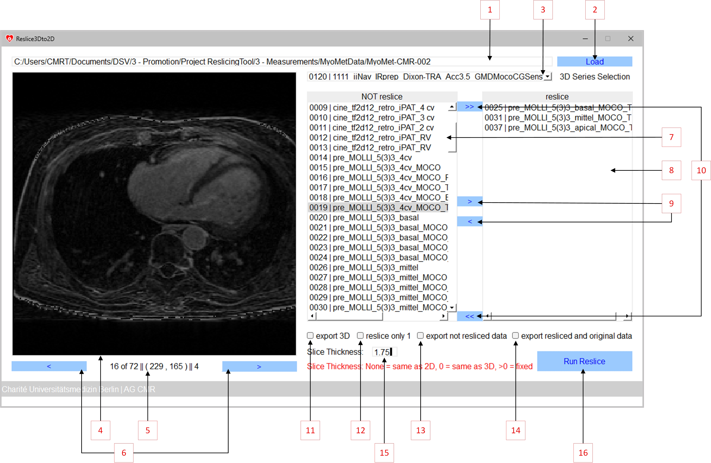

# Reslice3Dto2D

This sourcecode is part of the publication

Viezzer, D. et al. Reslice3Dto2D: Introduction of a software tool to reformat 3D volumes into reference 2D slices in 
cardiovascular magnetic resonance imaging. tba. https://doi.org/tba

## Installation
- Download and install Python 3.8 from https://www.python.org/downloads/
- Download the Reslice3Dto2D software
- Run in a command window pip install -r requirements.txt 

## Usage
The application can be started using the RUN.sh or RUN_WINDOWS.bat (Microsoft Windows only).

After starting the application, the click on (1) opens a dialog to choose a directory with data that should be imported. The user must ensure to choose a directory that contains only data from one examination. The load button (2) imports the DICOM data in the given directory from (1). Depending on the amount of data within the examination, this step may take some time. During that time, the GUI freezes. The suffix of the data can be arbitrary as each file is checked for DICOM information. The dropdown menu (3) automatically shows the sequence number and name of the first occurring 3D sequence. If multiple exist, the user can select the sequence of interest. The strict axial planes of the chosen 3D Dataset are shown in (4) and can be gone through with the next and previous buttons (6). The information (5) shows the current instance number, the total number of axial planes in the 3D dataset as well as the x and y location in points when hovering through (4) and its pixel value. The list in (7) shows all sequences that are neither the chosen 3D dataset nor a dataset that should be used as 2D reference slice. Therefore, the list in (8) is used to define all sequences that should be used for the reslicing. Between the lists (7) and (8) can be toggled by selecting one or multiple sequences and using the buttons (9). If all sequences should be used for reslicing or vice versa, the buttons (10) can be used.
For the export multiple options are available: In the default case, only the novel resliced data is exported. If the original 3D dataset should be exported in addition, the checkbox (11) is used. If in the reslice list (8) CINE images are selected, multiple DICOM data at the same slice position but different phase is given. In order to obtain only one resliced plane instead of multiple replicas, the checkbox (12) is used. In order to have the non-resliced data from list (7) exported as well, the checkbox (13) needs to be checked whereas if both, the original data from the reslice list in (8) as well as the resliced data should be exported, the checkbox (14) is necessary. Consequently, checking the boxes (11), (13) and (14) will export the complete dataset and the novel reformatted data into one directory.
The slice thickness option (15) defines the slice thickness of the resliced data. If None is given, then the slice thickness of the reference 2D data is used while a slice thickness of 0 results in the intrinsic slice thickness of the 3D data resolution. A detailed information about the slice thickness interpolation is given in the Implementation section. The run button (16) executes the reslicing and asks the user for a directory to export to.

